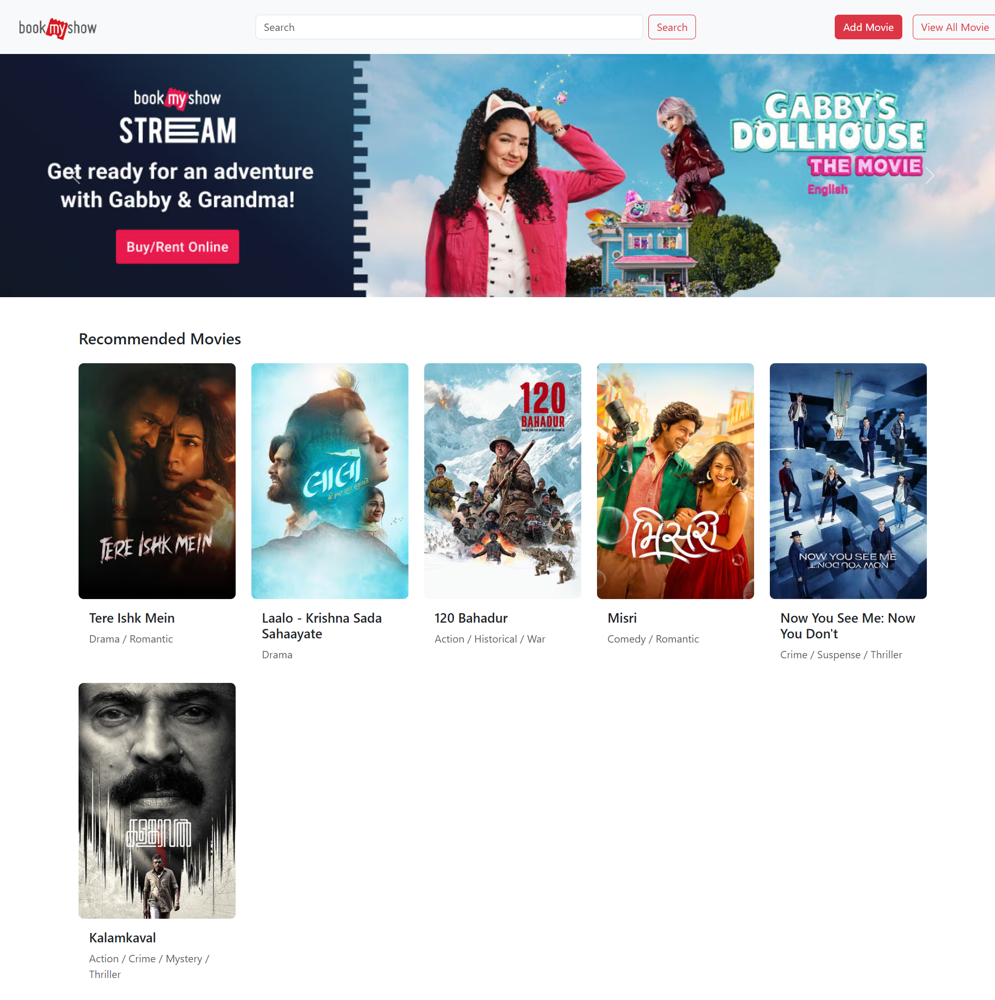
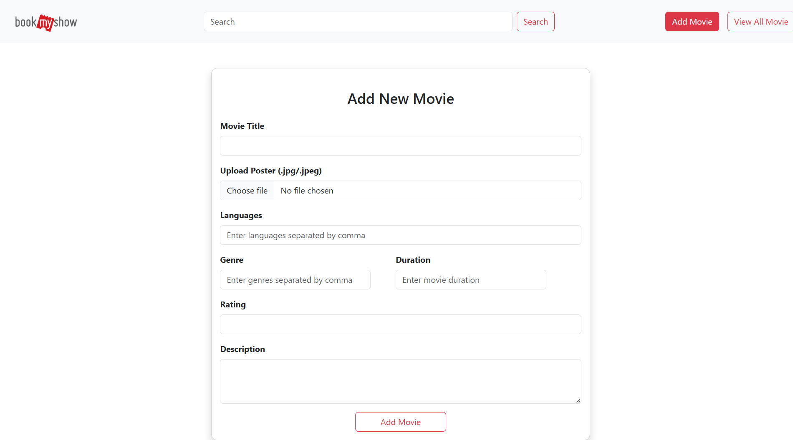

# 🎬 Movie Project

A simple web application for browsing and managing a movie collection, built with Node.js, Express, and EJS. This project demonstrates fundamental backend concepts like routing, templating, and handling form data.

---

## ✨ Features

- **View All Movies**: A gallery view of all movies in the collection.
- **View Movie Details**: Click on a movie to see its details, like the poster, year, and description.
- **Add New Movies**: A form to add a new movie to the collection.
- **Search/Filter**: (Optional) Functionality to search for movies by title.

---

## 📸 Screenshots

Here’s a sneak peek of what the application looks like.

**Home Page / Movie Gallery**
_A view showing all the movies in the database._



**Movie Details Page**
_A detailed view of a single movie._


**Add Movie Form**
_The form used to add a new movie to the collection._


---

## 🛠️ Tech Stack

This project is built using the following technologies:

- **Backend**: Node.js, Express.js
- **Templating Engine**: EJS (Embedded JavaScript)
- **Frontend**: HTML, CSS, JavaScript (ES6)
- **Development**: Nodemon for automatic server restarts

---

## 🚀 How to Run This Project

Follow these steps to get the project running on your local machine.

### 1. Clone the repository to your local machine:

Clone using this `Github` link and follow the steps:

```sh
git clone https://github.com/MokshPShah/React-Js.git
```

### 2. Navigate to the Project Folder

From the root of the `Node-Js` repository, change into the project directory:

```bash
cd Movie-Project
```

### 2. Install Dependencies

Install the required `npm` packages:

```bash
npm install
```

### 3. Start the Server

Run the application using `nodemon` (for development) or `node`:

```bash
npm start
```

This will typically start the server on port 3000.

### 4. Open in Browser

Open your web browser and navigate to:

```
http://localhost:3000
```

---

## 📂 Project Structure

- `/views`: Contains all EJS template files (`.ejs`).
- `/public`: Contains all static assets like CSS stylesheets, images, and client-side JavaScript.
- `app.js`: The main server file containing the Express application logic, routes, and middleware.
- `package.json`: Lists project dependencies and scripts.
